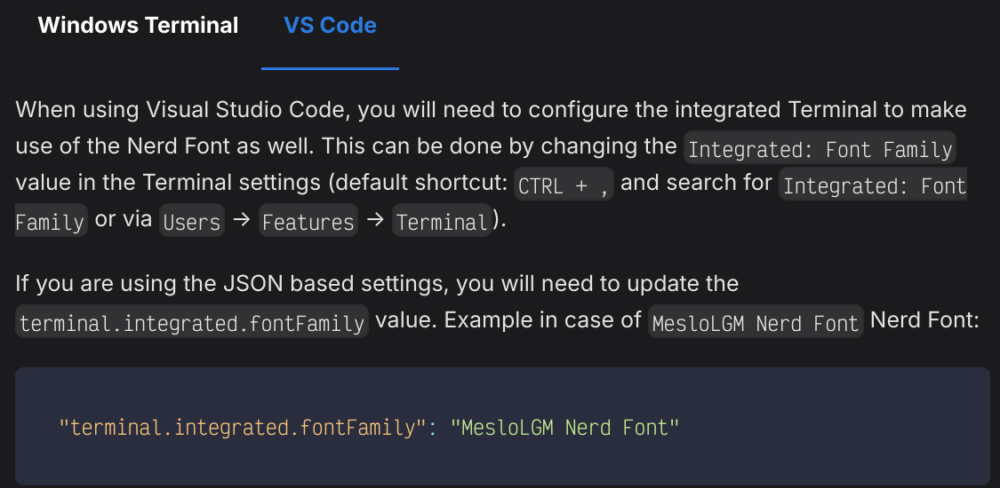
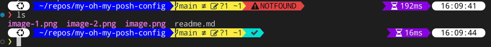

# My oh-my-posh setup

## Step 1 - Install Oh-My-Posh

Official instructions said to use

```bash
curl -s https://ohmyposh.dev/install.sh | bash -s
```

However that didn't work. So used the next suggested command:

```bash
curl -s https://ohmyposh.dev/install.sh | bash -s -- -d ~/bin
```

Also didn't work. Had to specify own directory as such:

```bash
curl -s https://ohmyposh.dev/install.sh | bash -s -- -d ~/.local/bin
```

## Step 2 - Install nerdfont

```bash
oh-my-posh font install
```

Picked 'DroidSansM Nerd Font'

## Step 3 - Added line to .bashrc

Added the following line

```bash
eval "$(oh-my-posh init bash)"
```

## Step 4 - Changed theme

Modified Step 3 to be as follows:

```bash
eval "$(oh-my-posh init bash --config ~/.cache/oh-my-posh/themes/powerlevel10k_modern.omp.json)"
```

## Step 5 - Fix VS Code

Fonts not showing up correctly in VS Code. Need to change font to one of the NerdFonts for symbols to show up.



Did not work for me. So had to add extra line in settings.json:

```bash
"terminal.integrated.gpuAcceleration": "canvas"
```

More info: <https://github.com/ryanoasis/nerd-fonts/issues/831>

## Step 6 - Modify config file to add code execution time

Make copy of desired base theme config to local folder with appropriate name

```bash
~/.config/oh-my-posh/themes/your-theme-config.json
```

Point oh-my-posh init in .bashrc to configure using own theme

```bash
eval "$(oh-my-posh init bash --config ~/.cache/oh-my-posh/themes/your-theme-config.json)"
```

Add following to right segment of config:

```json
{
 "type": "executiontime",
 "style": "powerline",
 "powerline_symbol": "",
 "foreground": "#ffffff",
 "background": "#8800dd",
 "template": " <#fefefe></> {{ .FormattedMs }} ",
 "properties": {
  "threshold": 500,
  "style": "austin",
  "always_enabled": true
 }
},
```

## Step 7 - Added git segment

Built-in git segment does not have git status.

Add the following:

```json
{
 "type": "git",
 "style": "powerline",
 "powerline_symbol": "",
 "foreground": "#193549",
 "background": "#ffeb3b",
 "background_templates": [
  "{{ if or (.Working.Changed) (.Staging.Changed) }}#FFEB3B{{ end }}",
  "{{ if and (gt .Ahead 0) (gt .Behind 0) }}#FFCC80{{ end }}",
  "{{ if gt .Ahead 0 }}#B388FF{{ end }}",
  "{{ if gt .Behind 0 }}#B388FB{{ end }}"
 ],
 "template": "{{ .UpstreamIcon }}{{ .HEAD }}{{if .BranchStatus }} {{ .BranchStatus }}{{ end }}{{ if .Working.Changed }}  {{ .Working.String }}{{ end }}{{ if and (.Working.Changed) (.Staging.Changed) }} |{{ end }}{{ if .Staging.Changed }}  {{ .Staging.String }}{{ end }}{{ if gt .StashCount 0 }}  {{ .StashCount }}{{ end }}",
 "properties": {
  "fetch_status": true,
  "fetch_stash_count": true,
  "fetch_upstream_icon": true,
  "untracked_modes": {
   "/Users/user/Projects/oh-my-posh/": "no"
  }
 }
}
```

Remove the existing git segment.

## Step 8 - Add status

```json
{
"background": "#03DED3",
"background_templates": [
 "{{ if gt .Code 0 }}#E44141{{ end }}"
],
"foreground": "#414141",
"foreground_templates": [
 "{{ if gt .Code 0 }}#D6DEEB{{ end }}"
],
"template": " {{ if gt .Code 0 }}\uf00d{{ else }}\uf00c{{ end }} ",
"type": "status",
"powerline_symbol": "",
"properties": {
 "always_enabled": true
},
"style": "powerline"
}
```

or (with error reason)

```json
{
 "background": "#03DED3",
 "background_templates": [
  "{{ if gt .Code 0 }}#E44141{{ end }}"
 ],
 "foreground": "#414141",
 "foreground_templates": [
  "{{ if gt .Code 0 }}#D6DEEB{{ end }}"
 ],
 "template": " {{ if eq .Code 0 }}\uf00c{{ else }}\uf071 {{ reason .Code }}{{ end }} ",
 "type": "status",
 "powerline_symbol": "",
 "properties": {
  "always_enabled": true
 },
 "style": "powerline"
}
```

### Final result


